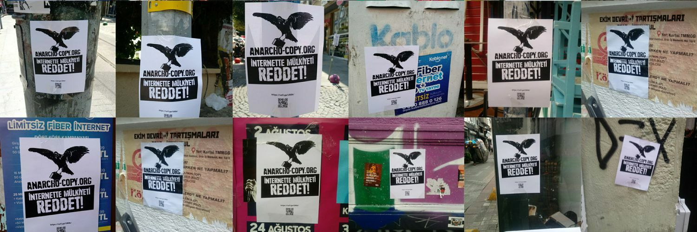

### Anarcho-Copy nedir?

Bilginin mülkiyetini reddeden; aynı zamanda onun evrensel bir deneyim olduğunu düşünen, bu sebeple imkanları yettiği ölçüde bilgiye erişimde olan engelleri hepimiz için aşan, bununla birlikte ağın(www) radikal bir şekilde dönüşümünden bahsederek kendini internet ortamında var eden, anarşist bir korsan kolektifidir.

 - Şimdilik öncelikli çalışma alanı anarşist ve özgürlükçü yayımlardır.
 - Kapitalizmi sürdüren ürünler çalışma alanı değildir.

### Servisler

<ul>
<li><a href="https://anarcho-copy.org/">anarcho-copy.org</a> | Anarşist ve Özgürlükçü Kitaplar Dizini (<a href="https://anarcho-copy.org/generator.tar.gz">kaynak kodu</a>) (<a href="https://anarcho-copy.org/archive.tar">archive</a>)</li>
<li><a href="https://edu.anarcho-copy.org/">edu.anarcho-copy.org</a> | Open Directory Data Archive for Computer Science and Its Philosophy (<a href="https://edu.anarcho-copy.org/archive/">archive</a>)</li>
<li><a href="http://edu.anarcho-copy.org/T%c3%bcrk%c3%a7e%20-%20Turkish/">edu.anarcho-copy.org/Türkçe</a> | Bilgisayar Bilimleri ve Felsefesine Yönelik Açık Dizin Arşivi</li>
<li><a href="https://tr.anarchistlibraries.net/special/index">tr.anarchistlibraries.net</a> | Anarşist Kütüphane</li>
</ul>

### Git

 - Gitlab: [@anarchocopy](https://gitlab.com/anarcho-copy)
 
### Tor

<ul>
<li><a href="http://anarcopym4ckplfg3uljfj37y27ko3vrnrp43msyu5k5rp3h46wtf7yd.onion">anarcopym4ckplfg3uljfj37y27ko3vrnrp43msyu5k5rp3h46wtf7yd.onion</a> | anarcho-copy.org</li>
<li><a href="http://educate6mw6luxyre24uq3ebyfmwguhpurx7ann635llidinfvzmi3yd.onion">educate6mw6luxyre24uq3ebyfmwguhpurx7ann635llidinfvzmi3yd.onion</a> | edu.anarcho-copy.org</li>
<li><a href="http://libfaqf556m6sqcme7kseel4zehmie6pkpu47bzbqzzaofn5xattfxad.onion">libfaqf556m6sqcme7kseel4zehmie6pkpu47bzbqzzaofn5xattfxad.onion</a> | ananarchistfaq.anarcho-copy.org</li>
 <li><a href="http://anarsizmhxyuq7nfuw2hirvflh2ly2p3ddczsnmxmbsn73rgiyytpyqd.onion">anarsizmhxyuq7nfuw2hirvflh2ly2p3ddczsnmxmbsn73rgiyytpyqd.onion</a> | tr.anarchistlibraries.net</li>
</ul>

### Sosyal

 - Mastodon: [@anarchocopy@kolektiva.social](https://kolektiva.social/@anarchocopy)
 - Telegram: [@anarchocopy](https://t.me/anarchocopy) 
 - IRC: [#anarchocopy](https://anarcho-copy.org/irc.html) (irc.anarchyplanet.org)

### İletişim 

 - anarchocopy{at} riseup{dot}net | GnuPG: [0x33B922CA](https://keys.openpgp.org/search?q=6DC0+E8D8+8CA0+13D6+760E++8E60+9A31+859C+33B9+22CA)

